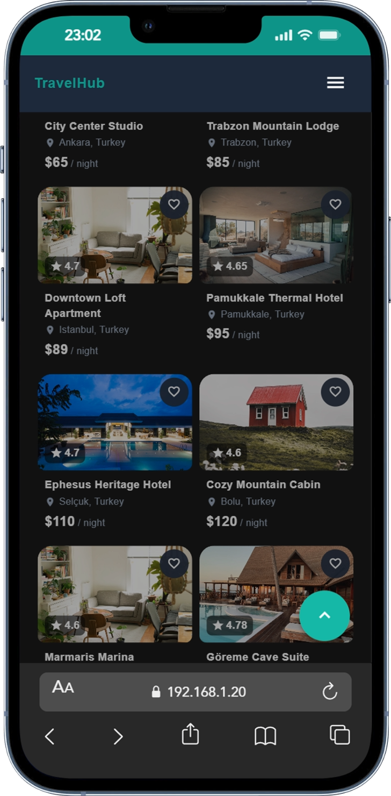

# TravelHub | Book Stays & Tickets

Modern bir seyahat platformu — konaklama rezervasyonu ve bilet arama için geliştirilmiş, **Nuxt 3** ve **Vuetify 3** tabanlı tam responsive web uygulaması.

---

## 📸 Önizlemeler

### Ana Sayfa — Light Mode
Ana sayfa hero bölümü, konaklama ve bilet arama sekmeleri ile popüler şehirler listesi.


### Ana Sayfa — Dark Mode
Karanlık tema ile ana sayfa görünümü.


### Mobil Görünüm
Responsive tasarım ile mobil cihazlarda görünüm.



---

## ✨ Özellikler

| Özellik | Açıklama |
|---------|----------|
| **Konaklama Arama** | Lokasyon, tarih, misafir sayısı ile filtreleme |
| **Bilet Arama** | Uçuş ve otobüs biletleri, tarih ve rota filtreleri |
| **Gerçek Şehir/Ülke Verisi** | JSON'dan yüklenen Avrupa ülkeleri ve şehirleri |
| **Responsive Tasarım** | Mobil, tablet ve masaüstü uyumlu |
| **Kart/Liste Görünümü** | Kullanıcı tercihine göre saklanan görünüm modu |
| **URL Senkronizasyonu** | Arama parametreleri URL ile senkronize |
| **SSR Desteği** | Nuxt 3 ile sunucu taraflı render |

---

## 🛠 Teknoloji Yığını

| Kategori | Teknoloji |
|----------|-----------|
| **Framework** | Nuxt 3 |
| **UI Kütüphanesi** | Vuetify 3 |
| **State Yönetimi** | Pinia |
| **Kalıcı State** | pinia-plugin-persistedstate |
| **Yardımcı** | nuxt-lodash |
| **Dil** | TypeScript |
| **Stil** | CSS + Vuetify |

---

## 📁 Proje Kurulumu

### Gereksinimler

- **Node.js** 18+ (önerilen: 20+)
- **npm** veya **pnpm**

### Adımlar

1. **Projeyi klonlayın**
   ```bash
   git clone https://github.com/gokhankatar/unversal-test-project
   cd unversal-test-project
   ```

2. **Bağımlılıkları yükleyin**
   ```bash
   npm install
   ```

3. **Geliştirme sunucusunu başlatın**
   ```bash
   npm run dev
   ```

4. **Tarayıcıda açın**
   - Uygulama **http://localhost:3000** adresinde çalışır
   - `0.0.0.0` host ile aynı ağdaki cihazlardan da erişilebilir

### Diğer Komutlar

| Komut | Açıklama |
|-------|----------|
| `npm run dev` | Geliştirme sunucusu (port 3000) |
| `npm run build` | Production build |
| `npm run preview` | Build sonrası önizleme |
| `npm run generate` | Static site üretimi |

---

## 📂 Proje Yapısı

```
test-project-demo/
├── app/
│   ├── components/          # Vue bileşenleri
│   │   ├── common/          # Ortak bileşenler (Loading, ScrollToTop)
│   │   ├── home/            # Ana sayfa (HeroSection, SearchTabs, BookingSearchForm, TicketSearchForm)
│   │   ├── layout/          # AppHeader, AppFooter
│   │   └── search/          # Arama sayfası (SearchBookingCard, SearchFilterPanel, vb.)
│   ├── composables/         # Composable'lar ve interface'ler
│   ├── layouts/
│   ├── pages/               # Sayfa rotaları
│   │   ├── index.vue        # Ana sayfa
│   │   ├── search/index.vue # Arama sayfası
│   │   ├── booking/[id].vue # Konaklama detay
│   │   └── ticket/[id].vue  # Bilet detay
│   ├── stores/              # Pinia store'ları
│   ├── utils/
│   └── assets/css/
├── server/
│   ├── api/                 # API endpoint'leri
│   │   ├── bookings/        # Konaklama API
│   │   ├── tickets/         # Bilet API
│   │   └── locations/       # Şehir/ülke autocomplete
│   └── data/                # Örnek veri dosyaları
│       ├── bookings.json
│       ├── tickets.json
│       └── eu_countries_with_city.json
├── public/
│   └── images/screenshots/  # Ekran görüntüleri
├── nuxt.config.ts
└── package.json
```

---

## 📊 Veri Kaynakları

### `server/data/` — Örnek Veriler

Proje, gerçekçi demo ve geliştirme için **sample veriler** kullanır:

| Dosya | İçerik |
|-------|--------|
| `bookings.json` | Konaklama ilanları (villa, apartman, otel vb.) |
| `tickets.json` | Uçuş ve otobüs biletleri |
| `eu_countries_with_city.json` | Avrupa ülkeleri ve şehirleri |

### Gerçek Ülke ve Şehir Verisi

**`eu_countries_with_city.json`** — Gerçek bir startup projesinde kullanılabilecek kalitede:

- **Kaynak:** Geonames benzeri yapıda (ülke kodu, başkent, dil, nüfus, koordinatlar vb.)
- **Kapsam:** Avrupa ülkeleri ve şehirleri
- **Kullanım:** `/api/locations` endpoint'i üzerinden lokasyon arama ve autocomplete
- **Format:** `countryName`, `countryCode`, `cities[]` (name, lat, lng, population vb.)

Bu veri, konaklama aramasında lokasyon seçimi için kullanılır; kullanıcı gerçek şehir ve ülke adlarıyla arama yapabilir.

---

## 🗄 Store Yapısı

### Pinia + `pinia-plugin-persistedstate`

| Store | Dosya | Amaç |
|-------|-------|------|
| `searchView` | `app/stores/searchView.ts` | Arama sayfası görünüm tercihi (kart / liste) |

**Özellikler:**

- `layout`: `'card'` veya `'list'`
- `setLayout(layout)`: Görünümü ayarlar
- `toggleLayout()`: Kart ↔ Liste arasında geçiş
- **Persist:** `travelhub-search-view` anahtarı ile `localStorage`'da saklanır

---

## 🚀 API Endpoint'leri

| Endpoint | Açıklama |
|----------|----------|
| `GET /api/bookings` | Konaklama listesi (location, minPrice, maxPrice, rating, type, limit, offset) |
| `GET /api/bookings/:id` | Tekil konaklama detayı |
| `GET /api/tickets` | Bilet listesi |

| `GET /api/locations` | Şehir/ülke autocomplete listesi (eu_countries_with_city.json) |

---

## 🎨 Görsel Öğeler

- **Fontlar:** Plus Jakarta Sans, Inter (Google Fonts)
- **Tema:** Vuetify light/dark (cookie: `travelhub-theme`)
- **Renk:** Primary `#0d9488` (teal)

---

## 📝 Lisans

Bu proje demo amaçlıdır.
